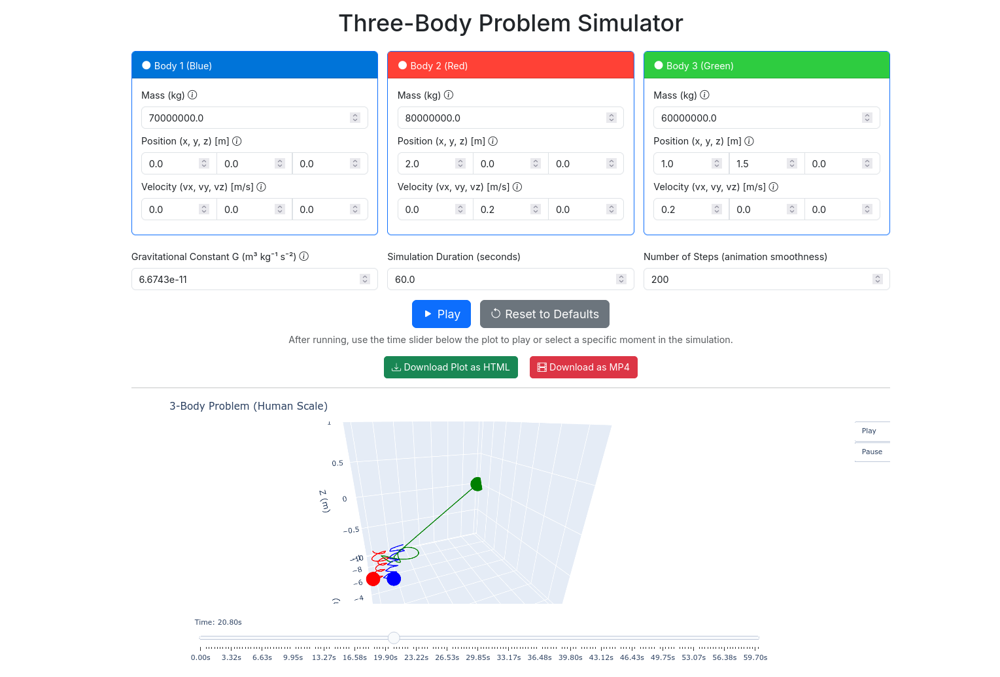
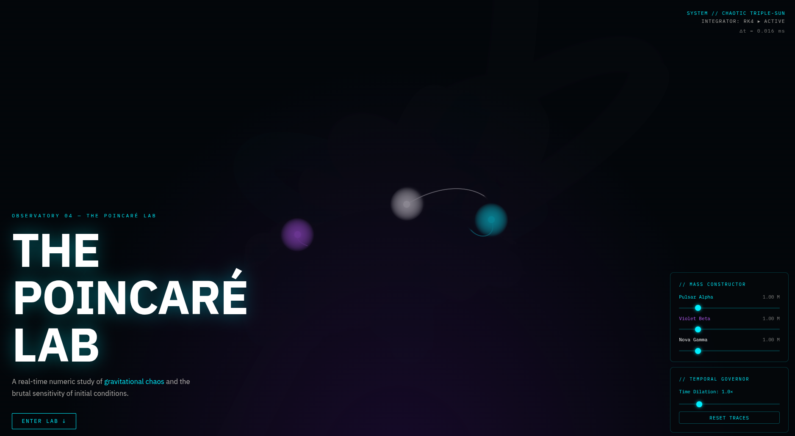

# ThreeBodies

The three body problem with python Flask. Vibe Coded.

```sh
git clone https://github.com/JAlcocerT/ThreeBodies
# In your project directory:
docker compose build
docker compose up
```

> Go to `localhost:5000`



See `./ThePoincareLab` folder for the React + Vite version created with `GEMINI.md`



```sh
./renderer_env/bin/python3 generate_animation.py --duration 10.0 --output simulation.mp4
./renderer_env/bin/python3 generate_animation.py --vel 0.2 -0.2 0.2 0.2 -0.3 0.0 --duration 300.0 --output simulation3.mp4
```


---

To test the Python Flask version:

```sh
#python -m venv solvingerror_venv #create the venv
python3 -m venv threebodies_venv #create the venv

#threebodies_venv\Scripts\activate #activate venv (windows)
source threebodies_venv/bin/activate #(linux)
```

**Install dependencies** with:

```sh
pip install python-dotenv
pip install Flask authlib requests #for LogTo
pip install logto # or `poetry add logto` or whatever you use
pip install hypercorn
pip install -r requirements.txt #all at once
#pip freeze | grep langchain

#pip show beautifulsoup4
pip list
pip freeze > requirements-output.txt #generate a txt with the ones you have!
```

```sh
python app.py
#python app-v2.py
#hypercorn app-v2:app --bind 0.0.0.0:5050
```